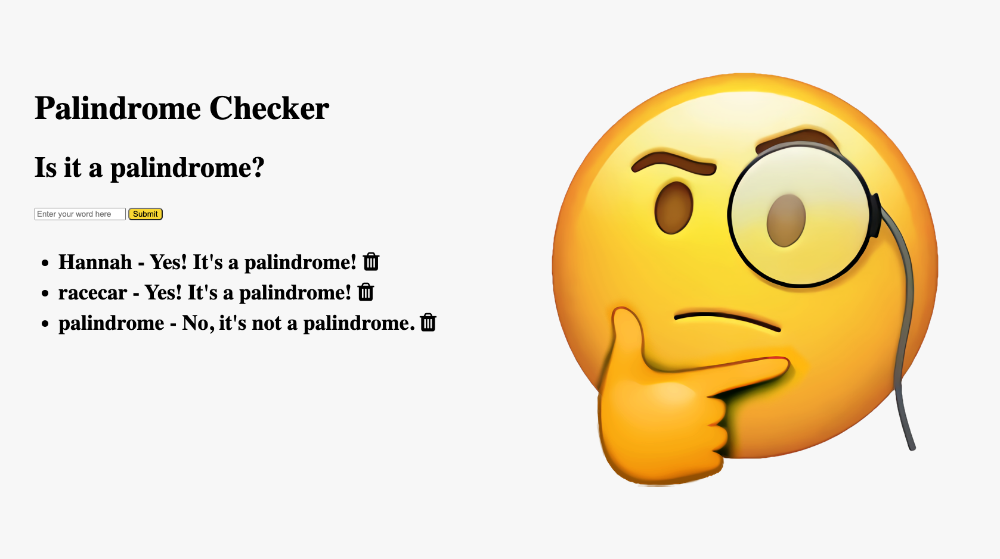

### Is it a palindrome? 
# 
Enter a word to find out if it reads the same forwards and backwards.

This app makes use of several javascript methods. The user's string input is converted into an array of single-letter string elements via the split method, then reversed via the reverse method and converted back to a string via the join method. The makeLowerCase method is applied to ensure that accurate comparisons can be made for inputs with instances of upper case letters. The input is a palindrome if the original input and its reverse are strictly equal to one another.# palindromeExpress
